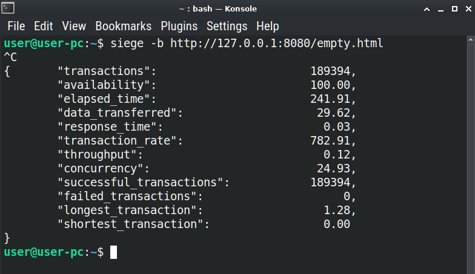

## Premières étapes:  
-démarrer le serveur :./runme
confirmer que le serveur a démarré avec succès.
-suivre les étapes ci-dessous pour tester le serveur, conformément aux documents d'audit.

## Matériaux personnalisés :
### Code d'état 403
Le code d'état 403 est un statut personnalisé (il n'y a pas de norme stricte pour le cas 403). Comme décrit dans la section README.md -> Détails et restrictions, implémenté pour le cas d'un accès avec un URI de répertoire avec une méthode autre que GET, comme moyen de faire respecter que seules les requêtes GET sont autorisées pour les URI de répertoire. Ce code d'état est généralement utilisé lorsque le serveur ne souhaite pas révéler exactement pourquoi la requête a été refusée, ou lorsqu'aucune autre réponse n'est applicable.
Commande de test : curl -X POST http://localhost:8080/
Commande de test : curl -X DELETE http://localhost:8080/
Affiche le contenu de la page 403.html.

### Code d'état 500
Pour simuler ce code d'état, lancez d'abord le serveur, puis endommagez le fichier, qui a déjà été vérifié avant le démarrage du serveur, et essayez ensuite d'accéder au fichier endommagé.
Le moyen le plus simple de procéder est de renommer le fichier
cgi/useless.py en cgi/_useless.py.
Essayez ensuite d'accéder au fichier endommagé, avec l'une des commandes suivantes :

curl http://localhost:8080/cgi/useless.py/useless_file pour la méthode GET.
curl -X POST http://localhost:8080/cgi/useless.py/useless_file pour la méthode POST.
curl -X DELETE http://localhost:8080/cgi/useless.py/useless_file pour la méthode DELETE.

Cela retournera le contenu de la page 500.html, mais pas celui de la page 404.html. La raison est que le fichier useless.py a été vérifié avant le démarrage du serveur. Et cela signifie que le serveur a été endommagé après le démarrage.

### Matériaux d'audit :

>Localhost consiste à créer votre propre serveur HTTP et à le tester avec un véritable navigateur.

>Prenez le temps nécessaire pour comprendre le projet et le tester, regarder dans le code source aidera beaucoup.

>Comment fonctionne un serveur HTTP ?

À l'intérieur d'un thread, pour chaque port géré, des tâches de concurrence ont été générées. Chaque tâche met en œuvre la gestion des connexions entrantes à l'aide de TcpListener, TcpStream, I/O asynchrone. La section flow.rs ... task::spawn(async move {.

>Quelle fonction a été utilisée pour le multiplexage d'E/S et comment fonctionne-t-elle ?

Le multiplexage d'E/S est une méthode qui permet à un programme de surveiller plusieurs canaux d'E/S (comme un socket réseau/TcpListener) en même temps. Mis en œuvre à l'aide de la méthode flow.rs ... listener.incoming().for_each_concurrent(None, |stream| async { pour gérer chaque connexion de manière concurrente dans une tâche séparée. Le None signifie qu'il n'y a pas de limite au nombre de tâches concurrentes (une nouvelle tâche est générée pour chaque connexion).

>Le serveur n'utilise-t-il qu'un seul select (ou équivalent) pour lire les requêtes des clients et écrire les réponses ?

Dans le contexte du réseau, select est une fonction utilisée pour le multiplexage d'E/S, qui permet à un programme de surveiller plusieurs canaux d'E/S (comme des sockets réseau) en même temps.
Mise en œuvre équivalente de select. La section flow.rs ... listener.incoming().for_each_concurrent(None, |stream| async { prend la connexion entrante sélectionnée dans la file d'attente des connexions entrantes incoming() qui est un itérateur non bloquant, et gère l'E/S du flux, à l'intérieur de la tâche générée.
Donc un seul équivalent de select est utilisé pour lire les requêtes des clients et écrire les réponses.

>Pourquoi est-il important d'utiliser un seul select et comment a-t-il été réalisé ?

Le select est utilisé pour attendre que plusieurs opérations se terminent et ensuite agir en fonction de celle qui se termine en premier. Il peut être utilisé pour gérer plusieurs opérations d'E/S de manière concurrente, mais il nécessite une gestion minutieuse des opérations et de leurs états.
La méthode for_each_concurrent est utilisée pour gérer plusieurs connexions de manière concurrente, ce qui est similaire à ce que fait select. Cependant, for_each_concurrent est de plus haut niveau et plus facile à utiliser, car elle gère automatiquement les tâches et leurs états.

>Lisez le code qui passe du select (ou équivalent) à la lecture et à l'écriture d'un client, n'y a-t-il qu'une seule lecture ou écriture par client par select (ou équivalent) ?

La lecture et l'écriture d'un client se trouvent à l'intérieur de la tâche générée, qui est générée pour chaque connexion. Donc il n'y a qu'une seule lecture ou écriture par client par select (ou équivalent).
La lecture est mise en œuvre dans la fonction flow.rs ... read_with_timeout.
L'écriture est mise en œuvre dans la fonction flow.rs ... match write_response_into_stream.

>Les valeurs de retour des fonctions d'E/S sont-elles correctement vérifiées ?

Les valeurs de retour des fonctions d'E/S sont correctement vérifiées.
Les unwrap sont bien gérés à l'aide de match en remplacement.

>Si une erreur est renvoyée par les fonctions précédentes sur un socket, le client est-il supprimé ?

Le match est utilisé pour gérer les erreurs, et le client est supprimé.
La section flow.rs ... task::spawn. La fin de cette section met en œuvre la suppression du client, naturellement, à la fin de la tâche générée. De plus, le return est utilisé pour quitter la tâche générée en cas d'erreurs de l'écriture.

>L'écriture et la lecture se font-elles TOUJOURS par le biais d'un select (ou équivalent) ?

L'écriture et la lecture se font toujours par le biais d'un équivalent de select, à l'intérieur de la section for_each_concurrent de la tâche générée.

>Configurez un seul serveur avec un seul port.

Le fichier settings, configuration avec server_name = "localhost".

>Configurez plusieurs serveurs avec différents ports.

Le fichier settings, configuration avec server_name = "default". Port 8082.
Le fichier settings, configuration avec server_name = "zone01.student". Port 8082.

>Configurez plusieurs serveurs avec différents noms d'hôtes (par exemple : curl --resolve test.com:80:127.0.0.1 http://test.com/).

Le fichier settings, configuration avec server_name = "zone01.bocal".
Commande de test : curl --resolve zone01.bocal:8082:127.0.0.2 http://zone01.bocal:8082/uploads
Affiche le contenu de la page 405.html avec le code d'état 405. La raison est que la méthode GET est NON AUTORISÉE pour les uploads dans les paramètres.

>Configurez des pages d'erreur personnalisées.

Le fichier settings. Tout paramètre de configuration error_pages_prefix est obligatoire.

>Limitez le corps du client (par exemple : curl -X POST -H "Content-Type: plain/text" --data "BODY with something shorter or longer than body limit").

Le fichier settings, configuration avec server_name = "localhost" et client_body_size = 11.
Commande de test : curl -X POST -H "Content-Type: application/x-www-form-urlencoded" --data-raw $'hello world' http://localhost:8080/cgi/useless.py/useless_file.
Affiche:

  Hello from Rust and Python3: PATH_INFO: /home/user/git/task-localhost
  The "/home/user/git/task-localhost/cgi/useless_file" is File

Commande de test : curl -X POST -H "Content-Type: application/x-www-form-urlencoded" --data-raw $'hello big world' http://localhost:8080/cgi/useless.py/useless_file.
Affiche le contenu de la page 413.html avec le code d'état 413. La raison est que la taille du corps est supérieure à client_body_size dans les paramètres.

>Configurez des routes et assurez-vous qu'elles sont prises en compte.

Selon la tâche, les routes peuvent être configurées à l'aide d'un ou de plusieurs paramètres :

>Configurez des routes avec un ou plusieurs des paramètres suivants : ...

Les paramètres suivants sont utilisés pour configurer les routes :

Définir une liste de méthodes HTTP acceptées pour la route.
Le paramètre routes du fichier settings.
Définir un fichier par défaut pour la route si l'URL est un répertoire.
Le paramètre default_file du fichier settings.

>Configurez un fichier par défaut au cas où le chemin serait un répertoire.

La configuration du fichier settings avec server_name = "default" et le paramètre default_file = "default.html".
Commande de test : curl http://127.0.0.2:8086/redirect.html.
Affiche le contenu de la page redirect.html.
Commande de test : curl http://127.0.0.2:8086/redirect.html/.
Affiche le contenu de la page par défaut index.html, car le chemin se termine par le caractère /, qui a été décidé d'être interprété comme un répertoire. C'est une pratique courante, mais ce n'est pas une règle stricte, et dépend de l'implémentation du serveur.

>Configurez une liste de méthodes acceptées pour une route (par exemple : essayez de SUPPRIMER quelque chose avec et sans autorisation).

La configuration du fichier settings avec server_name = "default" et routes = { "redirect.html" = [] } comme paramètres.
Commande de test : curl http://127.0.0.1:8082/redirect.html.
Affiche le contenu de la page 405.html avec le code d'état 405, car la méthode GET n'est pas autorisée pour redirect.html dans les paramètres.
La configuration du fichier settings avec server_name = "zone01.student" et routes = { "redirect.html" = ["GET", "POST", "DELETE"] } comme paramètres.
Commande de test : curl http://127.0.0.2:8086/redirect.html.
Affiche le contenu de la page redirect.html, car la méthode GET est autorisée pour redirect.html dans les paramètres.

>Les requêtes GET fonctionnent-elles correctement ?

Le code d'état 200 avec la commande de test : curl http://127.0.0.1:8088/.
Affiche le contenu de la page default.html. Ce cas met en œuvre le remplacement de la configuration du serveur par la configuration du serveur par défaut (le premier de la liste comme l'exige la tâche), si aucune configuration correcte n'est trouvée. La raison est que le port 8088 n'est pas configuré pour l'IP 127.0.0.1 dans les paramètres. Il utilise simplement la configuration du serveur par défaut pour traiter la requête. Ne sera pas répété pour les autres cas afin d'éviter un encombrement supplémentaire.
Le code d'état 200 avec la commande de test : curl http://127.0.0.2:8088/.
Affiche le contenu de la page index.html.
Le code d'état 400 avec la commande de test : curl -X GET -H "Content-Length: 1" -H "Content-Type: application/x-www-form-urlencoded" --data-raw $'hello world' http://127.0.0.2:8088/.
Affiche le contenu de la page 400.html. La raison est que les données du corps sont plus grandes que la valeur de l'en-tête Content-Length. C'est une simulation d'une requête GET avec un corps (ce qui n'est pas une pratique courante).
Le code d'état 403 a une implémentation personnalisée.
Le code d'état 404 avec la commande de test : curl http://127.0.0.2:8088/no.html
Affiche le contenu de la page 404.html. La raison est que le fichier no.html ne fait pas partie de la configuration du serveur.
Le code d'état 405 avec la commande de test : curl http://127.0.0.1:8088/redirect.html
Affiche le contenu de la page 405.html. La raison est que la méthode GET n'est pas autorisée pour redirect.html dans la configuration du serveur.
Le code d'état 413 avec la commande de test : `curl -X GET -H "Content-Length: 15"

>Les requêtes POST fonctionnent-elles correctement ?

Le code d'état 200 avec la commande de test : curl -X POST http://127.0.0.2:8087/redirect.html.
Affiche le contenu de la page redirect.html.
Le code d'état 400 avec la commande de test : curl -X POST -H "Content-Length: 1" -H "Content-Type: application/x-www-form-urlencoded" --data-raw $'hello world' http://127.0.0.2:8088/.
Affiche le contenu de la page 400.html. La raison est que les données du corps sont plus grandes que la valeur de l'en-tête Content-Length.
Le code d'état 403 a une implémentation personnalisée.
Le code d'état 404 avec la commande de test : curl -X POST http://127.0.0.2:8088/no.html
Affiche le contenu de la page 404.html. La raison est que le fichier no.html ne fait pas partie de la configuration du serveur.
Le code d'état 405 avec la commande de test : curl -X POST http://127.0.0.1:8088/redirect.html
Affiche le contenu de la page 405.html. La raison est que la méthode POST n'est pas autorisée pour redirect.html dans la configuration du serveur.
Le code d'état 413 avec la commande de test : curl -X POST -H "Content-Length: 15" -H "Content-Type: application/x-www-form-urlencoded" --data-raw $'hello big world' http://127.0.0.2:8088/
Affiche le contenu de la page 413.html. La raison est que la longueur du corps hello big world (15) est supérieure à client_body_size (11) dans la configuration du serveur.
La simulation du code d'état 500 a une implémentation personnalisée.

>Les requêtes DELETE fonctionnent-elles correctement ?

Le code d'état 200 avec la commande de test : curl -X DELETE http://127.0.0.2:8087/redirect.html.
Affiche le contenu de la page redirect.html.
Le code d'état 400 avec la commande de test : curl -X DELETE -H "Content-Length: 1" -H "Content-Type: application/x-www-form-urlencoded" --data-raw $'hello world' http://127.0.0.2:8088/.
Affiche le contenu de la page 400.html. La raison est que les données du corps sont plus grandes que la valeur de l'en-tête Content-Length.
Le code d'état 403 a une implémentation personnalisée.
Le code d'état 404 avec la commande de test : curl -X DELETE http://127.0.0.2:8088/no.html
Affiche le contenu de la page 404.html. La raison est que le fichier no.html ne fait pas partie de la configuration du serveur.
Le code d'état 405 avec la commande de test : curl -X DELETE http://127.0.0.1:8088/redirect.html
Affiche le contenu de la page 405.html. La raison est que la méthode DELETE n'est pas autorisée pour redirect.html dans la configuration du serveur.
Le code d'état 413 avec la commande de test : curl -X DELETE -H "Content-Length: 15" -H "Content-Type: application/x-www-form-urlencoded" --data-raw $'hello big world' http://127.0.0.2:8088/
Affiche le contenu de la page 413.html. La raison est que la longueur du corps hello big world (15) est supérieure à client_body_size (11) dans la configuration du serveur.
La simulation du code d'état 500 a une implémentation personnalisée.

>Testez une requête INCORRECTE, le serveur fonctionne-t-il toujours correctement ?

Commande de test : curl -X WRONG http://127.0.0.1:8088/redirect.html
ou
Commande de test : curl -X PUT http://127.0.0.1:8088/redirect.html
Affiche le contenu de la page 405.html Method Not Allowed.

>Téléchargez des fichiers sur le serveur et récupérez-les pour vérifier qu'ils n'ont pas été corrompus.

ouvrez le navigateur et allez sur http://127.0.0.2:8086/uploads.

Cette configuration vous permet de voir/télécharger/importer/supprimer des fichiers.
La raison est le paramètre uploads_methods = ["GET","POST","DELETE"].

ouvrez le navigateur et allez sur http://127.0.0.1:8082/uploads.

Cette configuration vous permet de voir/télécharger/importer des fichiers. Toute tentative de suppression de fichiers renverra le contenu de la page 405.html.
La raison est le paramètre uploads_methods = ["GET","POST"].
Toute tentative de télécharger un gros fichier renverra le contenu de la page 413.html.
La raison est le paramètre client_body_size = 1024.
La page web est codée en dur dans le fichier runme et est universelle pour tous les sites.

>Un système de session et de cookies fonctionnel est-il présent sur le serveur ?

Un système de session et de cookies fonctionnel est présent sur le serveur. Le fichier localhost/src/server/cookie.rs, peut être découvert pour quelques détails.
L'implémentation est pour les pages de site statique et ne procure aucun avantage réel pour l'utilisateur/le client. Il démontre simplement la fonctionnalité de base des sessions et des cookies.
La prochaine implémentation est utilisée :

le client fait une requête au serveur.
si le client n'a pas de cookie, fourni par le serveur, le serveur génère le cookie et l'envoie au client. Une copie du cookie est stockée dans la mémoire du serveur.
si le client a un cookie, fourni par le serveur auparavant, le serveur vérifie le cookie.
si le cookie fourni par le serveur est valide et n'a pas expiré, le serveur l'inclut dans les en-têtes de la réponse.
si le cookie fourni par le serveur a expiré, le serveur génère un nouveau cookie et l'envoie au client. Une copie du cookie est stockée dans la mémoire du serveur.
si le cookie fourni par le serveur n'est pas valide, le serveur génère un nouveau cookie et l'envoie au client. Une copie du cookie est stockée dans la mémoire du serveur.

Également pour éviter le gaspillage de mémoire, la prochaine implémentation est utilisée :

lorsqu'un cookie expiré est détecté, le cookie est supprimé de la mémoire du serveur.
toutes les 10 secondes lors d'une nouvelle requête, le serveur vérifie les cookies dans la mémoire du serveur et supprime les cookies expirés. Puis attend 10 secondes de plus.
le cookie créé par le serveur a un temps d'expiration de 60 secondes à partir du moment de sa création.
le cookie envoyé au client a la propriété Expires en fonction du temps d'expiration. Ainsi, un client n'envoie pas au serveur un cookie expiré.
le stockage des cookies est créé séparément pour chaque tâche générée, ce qui permet d'éviter des itérations supplémentaires pour supprimer les cookies expirés de la mémoire du serveur.

Pour montrer l'implémentation :

ouvrez le navigateur et allez sur http://127.0.0.1:8080/empty.html.
ouvrez l'onglet des cookies dans les outils de développement du navigateur.
actualisez la page.
vérifiez le cookie. Vous verrez le cookie fourni par le serveur (avec la date d'expiration).
actualisez la page.
vérifiez le cookie. Vous verrez toujours le même cookie fourni par le serveur (avec la date d'expiration).
attendez au moins une minute.
actualisez la page.
vérifiez le cookie. Vous verrez un nouveau cookie fourni par le serveur (avec une nouvelle date d'expiration).

Donc le système de session et de cookies est présent sur le serveur.

>Le navigateur se connecte-t-il au serveur sans problème ?

Ouvrez le navigateur et allez sur http://127.0.0.2:8086/uploads.
Affiche le contenu de la page uploads.html. Vous pouvez tester les méthodes GET, POST, DELETE.
Cette configuration vous permet de voir/télécharger/importer/supprimer des fichiers.

Les en-têtes de requête et de réponse sont-ils corrects ? (Il devrait servir un site Web statique complet sans aucun problème).

Ouvrez le navigateur et allez sur http://127.0.0.2:8086/.
Affiche le contenu de la page index.html. Sur cette page, vous pouvez tester le lien de redirection, le lien vers une autre configuration/site et le lien vers la page uploads.html.

>Essayez une mauvaise URL sur le serveur, est-elle gérée correctement ?

Ouvrez le navigateur et allez sur http://127.0.0.2:8086/no.html.
Affiche la page 404.html. Cela fonctionne comme prévu, car il n'y a pas de fichier no.html dans la configuration du serveur.

>Essayez de lister un répertoire, est-ce géré correctement ?

Ouvrez le navigateur et allez sur http://127.0.0.2:8086/no.html/.
Affiche le contenu de la page index.html. La raison est que le chemin se termine par le caractère /, qui a été décidé d'être interprété comme un répertoire, et le fichier index.html est configuré comme fichier par défaut pour le répertoire à l'aide du paramètre default_file = "index.html" dans les paramètres.
Donc c'est géré correctement, conformément à la configuration du serveur.

>Essayez une URL redirigée, est-ce géré correctement ?

Ouvrez le navigateur et allez sur http://127.0.0.1:8086/redirected.
Affiche la redirection universelle pour tous les sites vers /uploads codée en dur sur le côté serveur.
Ouvrez le navigateur et allez sur http://127.0.0.2:8086/redirect.html.
Affiche la redirection de redirect.html vers la page index.html.

>Vérifiez le CGI implémenté, fonctionne-t-il correctement avec des données chunked et non chunked ?

Commandes de test :

(cas sans corps) curl http://localhost:8080/cgi/useless.py/useless_file.
ou
(cas corps non chunked) curl -X POST -H "Content-Type: application/x-www-form-urlencoded" --data-raw $'hello world' http://localhost:8080/cgi/useless.py/useless_file.
ou
(cas corps chunked) curl -X POST http://localhost:8082/cgi/useless.py/useless_file -H "Transfer-Encoding: chunked" --data-raw $'5\r\nhello\r\n5\r\nworld\r\n0\r\n\r\n'

Affiche la sortie :
    Hello from Rust and Python3: PATH_INFO: /home/user/git/task-localhost
    The "/home/user/git/task-localhost/cgi/useless_file" is File

    Commande de test : curl -X POST http://localhost:8080/cgi/useless.py/useless_file -H "Transfer-Encoding: chunked" --data-raw $'5\r\nhello\r\n5\r\nworld\r\n0\r\n\r\n'
Affiche le contenu de la page 413.html (Payload Too Large). La raison est que la longueur du corps chunké (25 octets) est supérieure à client_body_size (11) dans la configuration du serveur.
Le cgi fonctionne comme prévu, selon l'approche d'implémentation choisie.

>Configurez plusieurs ports et sites Web et assurez-vous que cela fonctionne comme prévu.

Le fichier settings inclut la configuration des plusieurs ports et sites Web.
Les sites fonctionnent comme prévu (testés dans les sections précédentes).

>Configurez le même port plusieurs fois. Le serveur devrait trouver l'erreur.

La configuration du fichier settings avec server_name = "default" et ports = ["80","8082", "8082"] met en œuvre une tentative de configurer le même port plusieurs fois.
Lors de l'initialisation du serveur, les ports sont vérifiés et le message suivant est affiché :
=== Config "default" ports changed ===
from ["80", "8082", "8082"]
  to ["8082", "80"]

  Cela démontre que le serveur a trouvé l'erreur et l'a corrigée.

>Configurez plusieurs serveurs en même temps avec des configurations différentes mais avec des ports communs. Demandez pourquoi le serveur devrait fonctionner si l'une des configurations ne fonctionne pas.

La configuration du fichier settings avec server_name = "default" et server_address = "127.0.0.1" écoute le port 8082.
La configuration du fichier settings avec server_name = "zone01.bocal" et server_address = "127.0.0.2" écoute le port 8082.
Le serveur fonctionnera car seul le port 8082 est le même, mais les autres paramètres sont différents. Donc, à l'intérieur d'un thread, pour le même port, plusieurs tâches seront générées, et chaque tâche gérera de manière concurrente et indépendante les connexions pour la configuration de serveur différente.

>Utilisez siege avec une méthode GET sur une page vide, la disponibilité doit être d'au moins 99,5% avec la commande siege -b [IP]:[PORT].

Commande de test : siege -b http://127.0.0.1:8080/empty.html.
Affiche le résultat suivant :
"elapsed_time":                       241.91,
"data_transferred":                    29.62,
"response_time":                        0.03,
"transaction_rate":                   782.91,
"throughput":                           0.12,
"concurrency":                         24.93,
"successful_transactions":            189394,
"failed_transactions":                     0,
"longest_transaction":                  1.28,
"shortest_transaction":                 0.00

> Vérifiez qu'il n'y a pas de connexion en suspens. La section `flow.rs ... task::spawn`. La fin de cette section implémente la suppression du client, naturellement, à la fin de la tâche lancée. De plus, le `return` utilisé pour quitter la tâche lancée en cas d'erreurs de l'`écriture`. Après cela, la tâche est supprimée et la connexion est fermée, indépendamment du résultat de la tâche.
